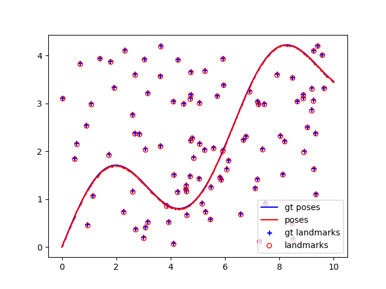
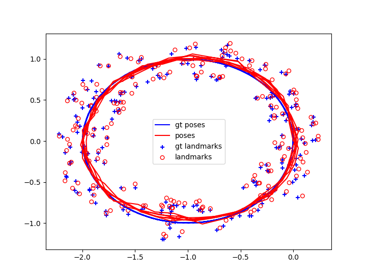
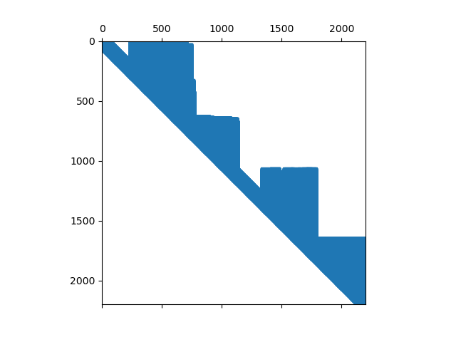

# SLAM - Least Square Optimization

## By Jae seok Oh

### Run Instruction

Run install_dep.sh

Within the folder code, run linear.py or nonlinear.py.
linear.py runs on linear system, nonlinear.py uses nonlinear measuremnt system.
By default solver method uses default method, which takes psuedo inverse to solve for states.
i.e. A.T A x = b.

Solve methods include LU , COLAMD LU, custom LU,QR, COLAMD QR, pinv.

linear data file path ../data/2d_linear.npz AND ../data/2d_linear_loop.npz
nonlinear data file path ../data/2d_nonlinear.npz
ex)

'python3 linear.py ../data/2d_linear.npz --method lu_colamd'

Linear Case - Trajectory comparison to ground truth

Linear Case on loop path - Trajectory with ground truth

Matrix sparsity representation. (Upper matrix from linear LU COLAMD)

